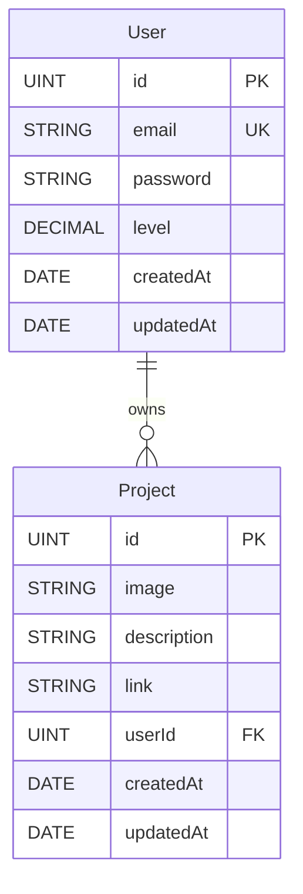

# MCD et MPD — PF2025

Ce document présente le Modèle Conceptuel de Données (MCD), le Modèle Physique de Données (MPD) et le passage de l’un à l’autre pour le projet PF2025. Il est aligné sur le code des modèles Sequelize actuels:
- `src/server/src/model/user.ts`
- `src/server/src/model/project.ts`

## 1) Contexte fonctionnel synthétique
- Authentification JWT pour des utilisateurs.
- Gestion de projets liés à un utilisateur (création, mise à jour, suppression).
- Upload éventuel d’une image de projet.

## Fichiers Draw.io
- MCD: `docs/mcd.drawio`
- MPD: `docs/mpd.drawio`

## 2) MCD (Modèle Conceptuel de Données)
Entités et attributs principaux:
- Utilisateur (`User`)
  - id
  - email
  - password
  - level
  - createdAt, updatedAt
- Projet (`Project`)
  - id
  - image
  - description
  - link
  - createdAt, updatedAt

Associations et cardinalités:
- Un `User` possède 0..N `Project`.
- Un `Project` appartient à 1 et 1 seul `User`.

Notations cardinalitaires:
- `User (1) —— (N) Project`

Diagramme (Mermaid, indicatif):

## 3) MPD (Modèle Physique de Données, MySQL)
Tables et contraintes (synthèse):
- Table `users`
  - `id` INT UNSIGNED AUTO_INCREMENT PK
  - `email` VARCHAR(128) NOT NULL UNIQUE
  - `password` VARCHAR(128) NOT NULL (longueur min. 6 côté applicatif)
  - `level` DECIMAL(10,2) NULL DEFAULT 0
  - `createdAt` DATETIME NULL
  - `updatedAt` DATETIME NULL
- Table `projects`
  - `id` INT UNSIGNED AUTO_INCREMENT PK
  - `image` VARCHAR(255) NULL
  - `description` VARCHAR(255) NOT NULL
  - `link` VARCHAR(255) NULL DEFAULT ''
  - `userId` INT NOT NULL FK → `users.id`
  - `createdAt` DATETIME NULL
  - `updatedAt` DATETIME NULL
- Index et contraintes
  - `users(email)` UNIQUE
  - `projects(userId)` INDEX + FK (`ON UPDATE CASCADE ON DELETE RESTRICT`)

NB: Le code Sequelize actuel déclare `level` en `DECIMAL(10.2)` (avec un point). MySQL attend le format `DECIMAL(10,2)` (avec une virgule). Le MPD ci-dessus retient la forme correcte `DECIMAL(10,2)`.

## 4) Passage MCD → MPD (règles appliquées)
- Clés primaires
  - Chaque entité devient une table avec une PK technique: `id` (INT UNSIGNED AUTO_INCREMENT).
- Attributs
  - Les attributs simples deviennent des colonnes (types choisis selon la taille/contraintes du code: `VARCHAR(128)` pour `email`/`password`, `VARCHAR(255)` pour `image`/`link`/`description`).
- Contraintes d’unicité
  - `email` est `UNIQUE` (contrainte fonctionnelle d’unicité des comptes).
- Association 1–N
  - L’association `User (1) —— (N) Project` devient une FK `projects.userId` référant `users.id`.
  - Règles d’intégrité référentielle: `ON UPDATE CASCADE`, `ON DELETE RESTRICT` pour éviter la suppression d’un utilisateur encore référencé par des projets.
- Dates de création/mise à jour
  - Colonnes `createdAt`, `updatedAt` (gérées par l’ORM). MPD: `DATETIME`.

## 5) Justification des choix de conception

### MCD (Modèle Conceptuel)
Le MCD privilégie la simplicité fonctionnelle avec deux entités principales : `User` et `Project`. Cette approche minimaliste correspond parfaitement au besoin métier d'un portfolio personnel où chaque utilisateur gère ses propres projets. La cardinalité 1-N entre User et Project reflète la réalité : un utilisateur peut créer plusieurs projets, mais chaque projet appartient à un seul utilisateur. Les attributs choisis couvrent les besoins essentiels : identification (email), sécurité (password), niveau d'autorisation (level), et description complète des projets (description, image, lien).

### MPD (Modèle Physique)
Le MPD traduit le MCD en structure MySQL optimisée pour les performances et la sécurité. Les clés primaires auto-incrémentées garantissent l'unicité et facilitent les jointures. La contrainte UNIQUE sur l'email empêche les doublons de comptes. La clé étrangère `userId` avec `ON DELETE RESTRICT` protège l'intégrité : impossible de supprimer un utilisateur ayant des projets. Le `ON UPDATE CASCADE` maintient la cohérence lors de modifications d'ID. Les types VARCHAR avec tailles appropriées (128 pour auth, 255 pour contenus) équilibrent stockage et flexibilité. L'encodage UTF8MB4 assure la compatibilité internationale complète.

## 5) Détails d’implémentation ORM (Sequelize)
- `User`
  - `email`: `unique: true`, validation `isEmail`, longueur `<=128`.
  - `password`: longueur 6..128 (validation applicative), hashé (`beforeCreate`/`beforeUpdate`).
  - `level`: valeur numérique, par défaut 0.
- `Project`
  - `description`: obligatoire.
  - `image`, `link`: optionnels, `link` par défaut "".
  - `userId`: obligatoire, référence `User.id`.

## 6) Évolutions possibles
- Déclarer explicitement l’association ORM: `User.hasMany(Project, { foreignKey: 'userId' })` et `Project.belongsTo(User, { foreignKey: 'userId' })` pour les chargements associés.
- Ajouter des contraintes: longueur minimale côté DB (CHECK) si moteur compatible, ou conserver au niveau applicatif.
- Indices additionnels: index sur `projects(createdAt)` si filtrage par date.

## 7) Script SQL
Voir `db/schema.sql` pour une version exécutable MySQL (InnoDB, UTF8MB4).
